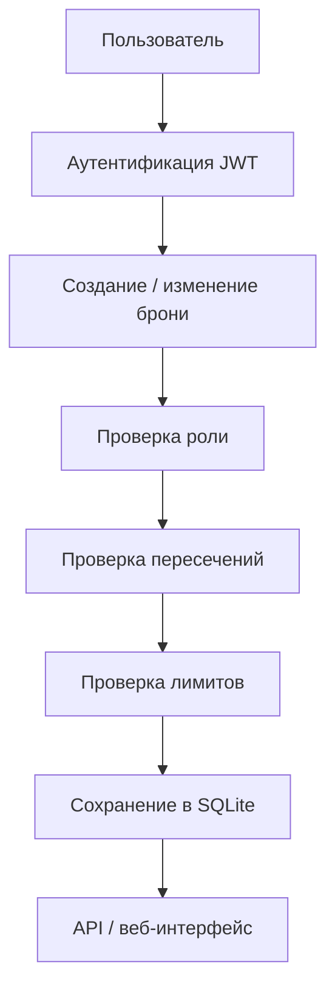

# Сервис бронирования переговорных и оборудования

## Кратко
REST API и веб-интерфейс для бронирования переговорных и оборудования: роли, JWT-аутентификация, ограничения, проверки пересечений и два варианта реализации.

## Задача
Построить прикладной сервис бронирования ресурсов с понятной доменной логикой, разграничением ролей и защитой от конфликтующих броней.

## Что улучшено
- реализована проверка пересечений по времени и дневных лимитов;
- поддержаны роли `User/Admin`;
- показаны два технологических варианта: FastAPI и ASP.NET Core.

## Архитектура

## Что показать в README
- какие сущности поддерживаются;
- какие правила валидации реализованы;
- какие роли и ограничения есть;
- какие сценарии покрыты тестами;
- чем отличаются FastAPI-реализация и ASP.NET Core-вариант.

## Функциональные результаты
| Возможность | Реализовано |
|---|---|
| JWT-аутентификация | Да |
| роли User/Admin | Да |
| проверка пересечений | Да |
| дневной лимит броней | Да |
| OpenAPI / Swagger | Да |
| веб-интерфейс | Да |
